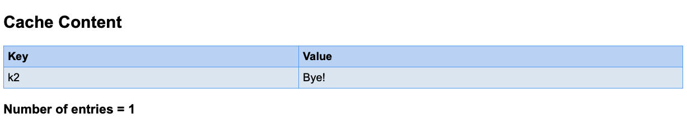

# Helidon MP Coherence Demo #

## Overview ##

This project describes how to build and run a Helidon Coherence demonstration application. You can follow step-by-step instructions for building and running a basic Coherence application developed using the Helidon Micro Profile framework that demonstrates the fundamental Coherence concepts. And understand how to override the default configuration files when creating your own Coherence configurations.

The sample application uses Helidon MP to demonstrate the ease of building a RESTful Coherence service and a static HTML/JavaScript frontend. The source code is available in this repository as Maven projects.


## Prerequisites ##

To run the demonstration application, you must have the following software installed:

1. Java 11 SE Development Kit - [Java SE Development Kit 11 Downloads](https://www.oracle.com/technetwork/java/javase/downloads/jdk11-downloads-5066655.html)

2. Oracle Coherence for Java 12.2.1.3.0 or later version installed. This demo application has been tested to run on 12.2.1.3.0 and 12.2.1.4.0 - [Oracle Coherence for Java Downloads](https://www.oracle.com/middleware/technologies/coherence-archive-downloads.html)

3. Apache Maven 3.6.1 or later version installed. Maven is used to build the demo application - [Apache Maven Download](https://maven.apache.org/download.cgi)

4. Linux/Unix/MacOS is required to run the commands in this repository. For Windows users, please convert commands to equivalent Windows syntax.


## Environment Variables ##

Ensure the following environment variable is set in your configuration:

1. JAVA_HOME - This variable must point to the location of the JDK version supported by the Oracle Coherence version that you use. Ensure that the path is set accordingly:
  ```
  export PATH=$JAVA_HOME/bin:$PATH
  ```
2. COHERENCE_HOME - This variable must point to the Coherence directory of your Coherence installation. This is required for starting the Coherence servers.
  ```
  export COHERENCE_HOME=/opt/Oracle/Middleware/Oracle_Home/Coherence
  ```

## Configure and Start a Cluster ##

### Define a Cache ###

Caches are defined in a cache configuration deployment descriptor and are referred to by name within an application. The cache configuration file allows changes to be made to a cache without having to change an application's code. The following cache configuration defines a basic distributed cache which is mapped to the cache name '`demo`'.


The cache is defined in an XML file named `example-config.xml` and we have one defined for you already [example-config.xml](https://github.com/Helidon-Demo/Helidon-MP-Coherence-Demo/blob/master/config/example-config.xml):

```
<?xml version="1.0"?>

<cache-config xmlns:xsi="http://www.w3.org/2001/XMLSchema-instance"
   xmlns="http://xmlns.oracle.com/coherence/coherence-cache-config"
   xsi:schemaLocation="http://xmlns.oracle.com/coherence/coherence-cache-config
   coherence-cache-config.xsd">
   <caching-scheme-mapping>
      <cache-mapping>
         <cache-name>demo</cache-name>
         <scheme-name>distributed</scheme-name>
      </cache-mapping>
   </caching-scheme-mapping>

   <caching-schemes>
      <distributed-scheme>
         <scheme-name>distributed</scheme-name>
         <service-name>DistributedCache</service-name>
         <backing-map-scheme>
            <local-scheme/>
         </backing-map-scheme>
         <autostart>true</autostart>
      </distributed-scheme>
   </caching-schemes>
</cache-config>
```

Please take note of the tag `<cache-name>demo</cache-name>`. This is where the name of the cache is defined.


### Configure The Demo Cluster ###

Caches are hosted on a Coherence cluster. At run time, any JVM process that is running Coherence automatically joins the cluster and can access the caches and other services provided by the cluster. When a JVM joins the cluster, it is called a cluster node, or alternatively, a cluster member. For this demo application, two separate Java processes form the cluster: a cache server process and a replica process. For simplicity, the two processes are collocated on a single computer.

The cache server, by default, is configured to store cache data.
The demo cluster uses an operational override file to modify the out-of-box default cluster configuration. In particular, the default configuration is modified to create a private cluster which ensures that the two processes do not attempt to join an existing Coherence cluster that may be running on the network. The default configuration is also modified to load the `example-config.xml` cache configuration file instead of the default cache configuration file.

To configure and start the demo cluster you will need a `tangosol-coherence-override.xml` which we have defined one for you already. [tangosol-coherence-override.xml](https://github.com/Helidon-Demo/Helidon-MP-Coherence-Demo/blob/master/config/tangosol-coherence-override.xml).

```
<?xml version='1.0'?>

<coherence xmlns:xsi="http://www.w3.org/2001/XMLSchema-instance"
   xmlns="http://xmlns.oracle.com/coherence/coherence-operational-config"
   xsi:schemaLocation="http://xmlns.oracle.com/coherence/coherence-operational-config
   coherence-operational-config.xsd">
   <cluster-config>
      <member-identity>
         <cluster-name>demo</cluster-name>
      </member-identity>
      <multicast-listener>
         <address>127.0.0.1</address>
         <time-to-live>0</time-to-live>
      </multicast-listener>
   </cluster-config>

   <configurable-cache-factory-config>
      <init-params>
         <init-param>
            <param-type>java.lang.String</param-type>
            <param-value system-property="coherence.cacheconfig">
               example-config.xml</param-value>
         </init-param>
      </init-params>
   </configurable-cache-factory-config>
</coherence>
```

The cluster name is already defined as `demo` and the cluster address is the localhost `127.0.0.1`. Since we are running the sample application and the Coherence cluster all on the same host, therefore we don't need to make any changes.

But real world scenarios, you will need to replace `address` with values that are unique for this cluster. For example, use a distinct IP address that is between 224.0.0.0 and 239.255.255.255:


### Start The Coherence Cache Server ###

Before you start a cache server, you need to download the [`example-config.xml`](https://github.com/Helidon-Demo/Helidon-MP-Coherence-Demo/blob/master/config/example-config.xml) and [`tangosol-coherence-override.xml`](https://github.com/Helidon-Demo/Helidon-MP-Coherence-Demo/blob/master/config/tangosol-coherence-override.xml). into a working directory or copy and paste from above.

From a command prompt, start a cache server instance in the same directory where the `example-config.xml` and `tangosol-coherence-override.xml` configuration files are downloaded; using the DefaultCacheServer class and include the location of the `coherence.jar` library as a Java -cp option.

For example:

```
java -cp "$COHERENCE_HOME/lib/coherence.jar:." com.tangosol.net.DefaultCacheServer

```

You should have an output something similar to below.

```
$ java -cp "$COHERENCE_HOME/lib/coherence.jar:." com.tangosol.net.DefaultCacheServer
2020-04-27 15:51:14.425/0.776 Oracle Coherence 12.2.1.3.0 <Info> (thread=main, member=n/a): Loaded operational configuration from "jar:file:/Users/Kwan/opt/oracle/wls213/coherence/lib/coherence.jar!/tangosol-coherence.xml"

...

2020-04-27 15:51:22.146/8.495 Oracle Coherence GE 12.2.1.3.0 <Info> (thread=main, member=n/a): Started cluster Name=demo, ClusterPort=7574

...

Started DefaultCacheServer...

2020-04-27 15:51:22.853/9.203 Oracle Coherence GE 12.2.1.3.0 <D5> (thread=DistributedCache, member=1): This member has become the distribution coordinator for MemberSet(Size=1
  Member(Id=1, Timestamp=2020-04-27 15:51:18.709, Address=192.168.0.3:52082, MachineId=62806, Location=process:12499, Role=C
    oherenceServer)

  )
```

Please take note of the `Started cluster Name=demo`. This is the cluster name defined in `tangosol-coherence-override.xml`.

Also take note of the membership of the cluster as being the first member `member=1`.


### Verify The Demo Cache ###

The cache server in this example is configured, by default, to store the cache's data. The data is available to all members of the cluster and persists even after members leave the cluster. For example, any updates we've made to the cache are still available for all cluster members as the cache is replicated to all cluster members.

We can verify the cache by using the cache factory command-line tool to connect to the demo cache and to add or list all items in the cache. It demonstrates both the persistent and distributed nature of Coherence caches.

To verify the cache:

1.  From a command prompt, start a standalone cache factory instance using the CacheFactory class and include the location of the `coherence.jar` library and the configuration files as a Java `-cp` option.

  For example:
  ```
  java -cp "$COHERENCE_HOME/lib/coherence.jar:." -Dcoherence.distributed.localstorage=false com.tangosol.net.CacheFactory
  ```

  The cache factory instance starts and becomes a member of the cluster and returns a command prompt for the command-line tool similar to below.

  ```
  2020-04-27 15:56:15.233/5.344 Oracle Coherence GE 12.2.1.3.0 <D5> (thread=Invocation:Management, member=2): Service Management joined the cluster with senior service member 1
  2020-04-27 15:56:15.303/5.414 Oracle Coherence GE 12.2.1.3.0 <Info> (thread=main, member=2): Loaded Reporter configuration from "jar:file:/Users/Kwan/opt/oracle/wls213/coherence/lib/coherence.jar!/reports/report-group.xml"

  Map (?):
  ```

  Please take note of the cluster joining as `member=2`.

2. At the command-line tool command prompt, get the `demo` cache using the cache command:
  ```
  cache demo
  ```

  You cache view should be in demo as below:
  ```
  Map (demo):
  ```

3. At the command-line tool command prompt, retrieve the contents of the cache using the list command.
  ```
  list
  ```
  The command returns null as there is nothing in the cache yet.

  Let's load an entry into the cache using the `put` command with first parameter as the key and the value as the second parameter.
  ```
  Map (demo): put k1 "Hello World!"
  null
  ```

4. Now, retrieve the contents of the cache again using the list command.
  ```
  Map (demo): list
  k1 = Hello World!
  ```

#### We now have a working Coherence cache with two members in a cluster. ####


## Deploying and Run The Demo Web Application ##

The demo application consists of two services:
- A Helidon MP Coherence Frontend Service - using the built in Web Server to serve a HTML page with JavaScript. The UI provides a form for you to add, delete and retrieve key value pairs to and from the cache. AJAX calls are made from the embedded JavaScript in the HTML page to the Helidon MP Coherence REST Service.

- A Helidon MP Coherence REST Service - a RESTful Java application using Coherence libraries to connect and access a Coherence Cache. RESTful APIs are handled asynchronously by the defined helper functions. A Coherence session is created and joins the running `demo` cluster as member 3. It requires the `example-config.xml` and `tangosol-coherence-override.xml` configurations used previously to start your cluster.

  


### Prepare The Application ###

1. Clone this project from GitHub:
  ```
  git clone https://github.com/kwanwan/Helidon-MP-Coherence-Demo
  ```

2.  After cloning the project, change directory to the project folder, for example
  ```
  cd projects
  ```

  You should find two Maven projects in this folder:
  ```
  coherence-helidon-mp-rest
  coherence-helidon-mp-ui
  ```

  We need to build each of these separately.

### Building and Starting the Helidon MP Coherence REST Service ###

We will use Maven to build the Helidon services.

1. Change directory to the `coherence-helidon-mp-rest` folder.
  ```
  cd coherence-helidon-mp-rest
  ```

2. Copy the Coherence library `coherence.jar` to the `localjar` folder of the project - you should have the location to the jar file from your Coherence installation/configuration step.
  ```
  cp $COHERENCE_HOME/lib/coherence.jar localjars/
  ```
3. Run the Maven command `mvn` to add the `coherence.jar` to the your local Maven repository.
  ```
  mvn install:install-file -Dfile=/home/opc/coherence-helidon-mp-rest/localjars/coherence.jar \
  -DgroupId=coherence -DartifactId=coherence -Dversion=12.2.1.0 -Dpackaging=jar
  ```

  You should see the BUILD SUCCESS message for installing the library similar to below:
  ```
  [INFO]
  [INFO] ------------------------------------------------------------------------
  [INFO] Building helidon-coh-mp 1.0-SNAPSHOT
  [INFO] ------------------------------------------------------------------------
  [INFO]
  [INFO] --- maven-install-plugin:2.4:install-file (default-cli) @ helidon-coh-mp ---
  [INFO] Installing /home/opc/coherence-helidon-mp-rest/localjars/coherence.jar to /home/opc/.m2/repository/coherence/coherence/12.2.1.0/coherence-12.2.1.0.jar
  [INFO] Installing /var/folders/y7/f7lcynss0r35nnrpdxt3fd880000gn/T/mvninstall5079648611806531303.pom to /home/opc/.m2/repository/coherence/coherence/12.2.1.0/coherence-12.2.1.0.pom
  [INFO] ------------------------------------------------------------------------
  [INFO] BUILD SUCCESS
  [INFO] ------------------------------------------------------------------------
  [INFO] Total time: 5.591 s
  [INFO] Finished at: 2020-04-20T15:00:34+08:00
  [INFO] Final Memory: 13M/363M
  [INFO] ------------------------------------------------------------------------
  ```

4. While still in the `coherence-helidon-mp-rest` folder, we will build the project with the following Maven command:
  ```
  mvn package -DskipTests
  ```

  You should see the BUILD SUCCESS message similar to below:

  ```
  [INFO] --- maven-jar-plugin:3.0.2:jar (default-jar) @ coherence-helidon-mp-rest ---
  [INFO] Building jar: /home/opc/coherence-helidon-mp-rest/target/coherence-helidon-mp-rest.jar
  [INFO] ------------------------------------------------------------------------
  [INFO] BUILD SUCCESS
  [INFO] ------------------------------------------------------------------------
  [INFO] Total time:  5.619 s
  [INFO] Finished at: 2020-04-27T17:03:09+08:00
  [INFO] ------------------------------------------------------------------------
  ```

5. Copy the 2 Coherence config files to the target folder - you have previously obtained the Coherence config files during the configuration of your coherence cluster. These files are also available under the config directory of this repository. Assuming you're inside the `coherence-helidon-mp-rest` folder:
  ```
  cp ../../config/example-config.xml target/
  cp ../../config/tangosol-coherence-override.xml target/
   ```

6. Starting the Helidon MP Coherence REST Microservice.
  ```
  cd target
  java -jar -Dcoherence.distributed.localstorage=false -Dtangosol.coherence.override=./tangosol-coherence-override.xml coherence-helidon-mp-rest.jar
  ```

  If successful, you should see the service available at port 8082.
  ```
  2020.04.27 17:11:55 INFO io.helidon.common.HelidonFeatures Thread[main,5,main]: Helidon MP 2.0.0-M2 features: [CDI, Config, FaultTolerance, Health, JAX-RS, Metrics, Security, Server, Tracing]
  http://localhost:8082/coherence
  ```

  Your Helidon REST Microservice is now up and running.


### Building and Starting The Helidon MP Coherence UI Service ###

The steps for building and starting the frontend Microservice is simlar to the REST service above. We will use Maven to build the service.

1. Change directory to the `coherence-helidon-mp-ui` folder.
  ```
  cd coherence-helidon-mp-ui
  ```

2. We will build the project with the following Maven command:
  ```
  mvn package -DskipTests
  ```

  You should see the BUILD SUCCESS Message.
  ```
  [INFO] --- maven-jar-plugin:3.0.2:jar (default-jar) @ coherence-helidon-mp-ui ---
  [INFO] Building jar: /home/opc/coherence-helidon-mp-ui/target/coherence-helidon-mp-ui.jar
  [INFO] ------------------------------------------------------------------------
  [INFO] BUILD SUCCESS
  [INFO] ------------------------------------------------------------------------
  [INFO] Total time:  4.979 s
  [INFO] Finished at: 2020-04-27T17:25:08+08:00
  [INFO] ------------------------------------------------------------------------
  ```

3. Starting the Helidon MP Coherence REST Microservice.
  ```
  cd target
  java -jar coherence-helidon-mp-ui.jar
  ```

  If successful, you should see the service available at port 8080.
  ```
  INFO: Server initialized on http://localhost:8080 (and all other host addresses) in 3460 milliseconds.
  Start server: 318
  Endpoint available at http://localhost:8080/cachemap
  ```

  Your Helidon UI Microservice is now up and running.


### Testing The Demo Application ###

In this sample application you can upload new entries to the cache as key value pairs. Delete an entry and also retrieve a single entry or all the entries from the cache.

The content of the cache will be refreshed inside a table at the bottom of the page after each action. However, if the table is not refreshed automatically, please click on the **Display Cache** button to refresh it manually.

1. From a browser, run the frontend application by loading the cachemap.html file using the following URL:
  ```
  http://localhost:8080/cachemap/cachemap.html
  ```

2. Display the cache by clicking on **Display Cache**.

  

  You should see the entry you previously added to the cache through the command-line tool. This invokes the Coherence **get()** API to retrieve the entries.

  

  When the **Display Cache** button is clicked, it makes a AJAX call to the REST Microservice. The REST Microservice will instantiate a Coherence session and joins the running `demo` cluster as member 3. You should see output in the first cache server instance you started using the **DefaultCacheServer** class similar to below:
  ```
  2020-04-27 17:40:10.688/60.004 Oracle Coherence GE 12.2.1.3.0 <D5> (thread=DistributedCache, member=2): Member 3 joined Service DistributedCache with senior member 1
  ```

3. Try uploading a new entry by entering the key value pair and then click on **Add Entry**. This invokes the Coherence **put()** API to upload the entry.

  

  The cache content will be displayed at the bottom of the page after a successful upload.

  

  Click **Return**

4. Now try deleting a cache entry by entering the key of an existing entry and click on **Delete Entry**. This invokes the Coherence **remove()** API to delete an entry.

  

  Again, if successful, the cache content will be refreshed.

  


### Verify The Demo Cache ###

We can verify the updates made by the Helidon demo application are accessible by other members of the cluster with the cache factory command-line tool.

The data in the cache is available to all members of the cluster and persists even after some members leave the cluster. For example, if the Helidon demo application quits. However, the cache and its content are still available for all cluster members.

We can use the cache factory command-line tool to connect to the `demo` cache to list all items in the cache. It demonstrates both the persistent and distributed nature of Coherence caches.

To verify the cache:

1. Go to the terminal of your cache factory command-line tool. You should still have this opened.

2. At the command-line tool command prompt, retrieve the contents of the cache using the list command.
  ```
  list
  ```

3. The content of the cache should be the same as displayed in the Helidon frontend service.
  ```
  Map (demo): list
  k2 = Bye!
  ```

## Congratulation - You have successful completed the demo !! ##
